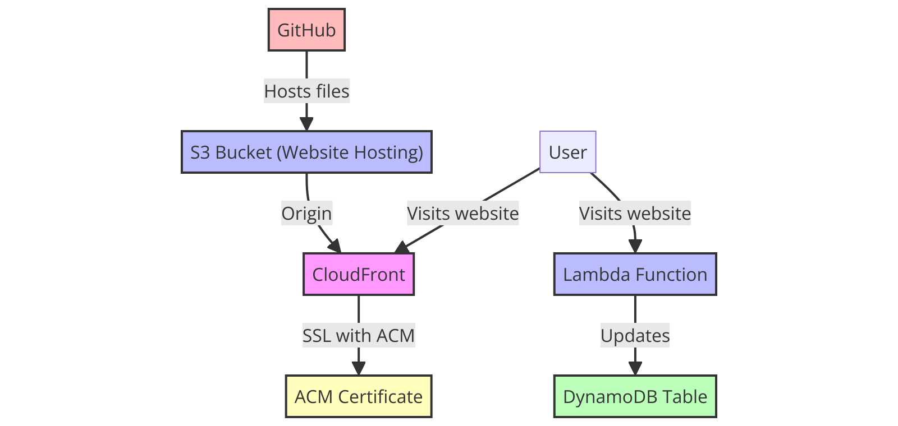

# Cloud Resume Challenge

[My Website](https://resume.eliandm.com/)

I recently completed the "cloud resume challenge", a hands-on project that incorporates many of the real-world skills that cloud and DevOps engineers use in their daily work. This project allows me to showcase my expertise in AWS and related technologies. Following the challenge, I created this resume/portfolio website which showcases my work experience, education, projects, and certifications.

Tasks achieved:

- Created a website using HTML and CSS.
- Hosted the website on an AWS S3 bucket and allowed access only through a CloudFront distribution.
- Implemented visitor tracking using a combination of Lambda functions, a DynamoDB database, and JavaScript.
- Used Terraform to quickly provision and de-provision the resources used in the project.
- Incorporated a CI/CD pipeline using GitHub Actions to sync site changes to an S3 bucket.

[The Cloud Resume Challenge](https://cloudresumechallenge.dev/)
